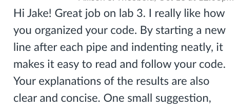

[**My Grade:**]{.underline} I believe my grade equivalent to course work evidenced below to be an A.

-   I believe I have earned this grade since I have proficiency with all learning targets, have submitted revisions for all but a few assignments, provided constructive feedback every week, was always an excellent partner when collaborating, and regularly pushed myself to use what is learned in class in assignments and difficult problems (i.e. the yaml theme of this portfolio).

[**Learning Objective Evidence:**]{.underline} In the code chunks below, provide code from Lab or Challenge assignments where you believe you have demonstrated proficiency with the specified learning target. Be sure to specify **where** the code came from (e.g., Lab 4 Question 2).

## Working with Data

**WD-1: I can import data from a *variety* of formats (e.g., csv, xlsx, txt, etc.).**

-   `csv` Example 1

```{r}
#| label: wd-1-csv-1
surveys <- read_csv(here("week2", "lab2", "surveys.csv"))  
# revisions from lab2 Q1
```

-   `csv` Example 2

```{r}
#| label: wd-1-csv-2
evals <- read_csv(here("week3", "teacher_evals.csv"))
# revisions from lab3 Q2
```

-   `xlsx`

```{r}
#| label: wd-1-xlsx
library(tidyverse)
library(readxl)
install.packages("scales")
library(scales)
military <- read_xlsx("gov_spending_per_capita.xlsx",
                      sheet = "Share of Govt. spending",
                      skip  = 7,
                      n_max = 190,
                      na = c(". .", "xxx", "..")
                      )
#practice activity 4 q1
```

**WD-2: I can select necessary columns from a dataset.**

-   Example selecting specified columns

```{r}
#| label: wd-2-ex-1
new_evals |>
  distinct(teacher_id, .keep_all = TRUE) |> 
  select(academic_degree, seniority, sex) |>
  mutate(across(everything(),as.character)) |>
  pivot_longer(everything(), names_to = "Variable", values_to = "Category") |>  
  count(Variable, Category, name = "Count") |>
  kable(caption = "Demographics summary of instructors")  
# lab 9 q5
```

-   Example removing specified columns

```{r}
#| label: wd-2-ex-2
mycifun <- function(beta0, beta1, n){
  x <- runif(n, min = 0, max = 1)
  ep <- rnorm(n, mean = 0, sd = 1)
  y  <- beta0 + beta1 * x + ep
  df <- tibble(x = x,
               y = y) 
  lin_regress <- lm(y ~ x, data = df)
  slope_info <- tidy(lin_regress, conf.int = TRUE) |>
    mutate(
      cover = ifelse(conf.low <= 1 & conf.high >= 1, 1, 0)
    ) |>
    filter(term == "x") |>
    select(-std.error, -statistic, -p.value)
  return(slope_info)
} 

# revised from lab10 q8
```

-   Example selecting columns based on logical values (e.g., `starts_with()`, `ends_with()`, `contains()`, `where()`)

```{r}
#| label: wd-2-ex-3
person_license <- full_join(person, drivers_license, by = c("license_id" = "id"))


suspects <- get_fit_now_check_in |>
  filter(check_in_date == 20180109) 

suspects <- left_join(get_fit_now_member, suspects, by = c("id" = "membership_id")) |> 
  filter(membership_status == "gold" & str_detect(id, pattern = "^48Z")) |> select(person_id)

suspects <- left_join(suspects, person_license, by = c("person_id" = "id")) |>
  filter(str_detect(plate_number, pattern = "H42W"))

suspects

suspects <- right_join(interview, suspects) |>
    select(name, hair_color, height, event_name, date, starts_with("car_"))

suspects
# revised from lab5 3rd chunk
```

**WD-3: I can filter rows from a dataframe for a *variety* of data types (e.g., numeric, integer, character, factor, date).**

-   Numeric Example 1

```{r}
#| label: wd-3-numeric-ex-1
averages |> filter(avg_q1 == min(avg_q1) | avg_q1 == max(avg_q1))
#Lab 3 Q2
```

-   Numeric Example 2

```{r}
#| label: wd-3-numeric-ex-2
averages <- teacher_evals_clean |> 
  filter(question_no == 901) |>
  group_by(teacher_id) |> 
  summarise( 
    n_courses = n_distinct(course_id),
    avg_q1 = mean(SET_score_avg, na.rm=TRUE), 
    .groups="drop"
  ) |>
  filter(n_courses>=5) 
#Lab 3 Q2
```

-   Character Example 1 (any context)

```{r}
#| label: wd-3-character
ca_childcare <- counties |>
  filter(state_abbreviation == "CA") |>
  left_join(childcare_costs, 
            counties, by = "county_fips_code")
#lab 4 Q2
```

-   Character Example 2 (example must use functions from **stringr**)

```{r}
#| label: wd-3-string
response_averages <- teacher_evals_clean |> 
  filter(str_detect(academic_degree, "dr|prof")) |>
  group_by(teacher_id) |>
  filter(row_number() == 1) |> #got this from chat https://chatgpt.com/share/e/68e34425-f764-8010-a98b-0a7e4b54b002
  summarise(
    avg_responses = mean(resp_share, na.rm = TRUE),
    seniority = seniority,
    sex = sex,
    .groups = "drop"
  ) 
#lab3 Q12
```

-   Date (example must use functions from **lubridate**)

```{r}
#| label: wd-3-date
crime_date <- ymd("20180115")

crime_date
 
crime_scene_report <- crime_scene_report |> 
  rename(date_col = date) |>
  mutate(new_date = ymd(as.character(date_col))) |> 
  filter(new_date == crime_date & type == "murder" & city == "SQL City") |>
  select(description)

crime_scene_report 

#lab5 first part

```

**WD-4: I can modify existing variables and create new variables in a dataframe for a *variety* of data types (e.g., numeric, integer, character, factor, date).**

-   Numeric Example 1

```{r}
#| label: wd-4-numeric-ex-1
mycifun <- function(beta0, beta1, n){
  x <- runif(n, min = 0, max = 1)
  ep <- rnorm(n, mean = 0, sd = 1)
  y  <- beta0 + beta1 * x + ep
  df <- tibble(x = x,
               y = y) 
  lin_regress <- lm(y ~ x, data = df)
  slope_info <- tidy(lin_regress, conf.int = TRUE) |>
    mutate(
      cover = ifelse(conf.low <= 1 & conf.high >= 1, 1, 0)
    ) |>
    filter(term == "x") |>
    select(-std.error, -statistic, -p.value)
  return(slope_info)
} 
#lab10 question 8
```

-   Numeric Example 2

```{r}
#| label: wd-4-numeric-ex-2
fish <- fish |> 
  mutate(length = length/10)
fish
#challenge 7 question 1
```

-   Factor Example 1 (renaming levels)

```{r}
#| label: wd-4-factor-ex-1
ca_childcare |> 
  select(study_year, mc_infant, mc_toddler, mc_preschool, census_region) |>
  pivot_longer(
    cols = c(mc_infant, mc_toddler, mc_preschool),
    names_to = "child_type",
    values_to = "median_price") |>
   mutate(
    child_type = child_type |>
      fct_recode(
        "Infant"   = "mc_infant",
        "Toddler"  = "mc_toddler",
        "Preschool" = "mc_preschool"
      ) |>
      fct_relevel("Infant", "Toddler", "Preschool")
  ) |>
  ggplot(aes(x = study_year,
             y = median_price,
             color = fct_reorder2(.f = census_region,
                                  .x = study_year,
                                  .y = median_price))) +
  facet_wrap(~ child_type, ncol = 3) +
  geom_point() +
  geom_smooth() +
  scale_x_continuous(breaks = seq(2008, 2018, by = 2)) +
  scale_y_continuous(limits = c(100, 500),
                     breaks = seq(100, 500, by = 100)) +
  theme(aspect.ratio = 1,
        axis.text.x  = element_text(size = 6),
        axis.text.y = element_text(size = 7)) + 
  labs(x = "Study Year",
       y = "",
       color = "California Region",
       title = "Weekly Median Price for Center-Based Childcare ($)")
#lab4 part 7 revised
```

-   Factor Example 2 (reordering levels)

```{r}
#| label: wd-4-factor-ex-2
df_long <- ca_childcare |>
  select(
    study_year, census_region,
    mc_infant, mc_toddler, mc_preschool,
    mfcc_infant, mfcc_toddler, mfcc_preschool
  ) |>
  pivot_longer(
    cols = matches("^(mc|mfcc)_(infant|toddler|preschool)$"),
    names_to = c("care_type", "child_type"),
    names_sep = "_",
    values_to = "median_price"
  ) |>
  mutate(
    care_type = care_type |>
      fct_recode(
        "Family-based"  = "mfcc",
        "Center-based"  = "mc"
      ) |>
      fct_relevel("Family-based", "Center-based"),  

    child_type = child_type |>
      fct_recode(
        "Infant"    = "infant",
        "Toddler"   = "toddler",
        "Preschool" = "preschool"
      ) |>
      fct_relevel("Infant", "Toddler", "Preschool")  
  )


blues <- colorRampPalette(c("lightblue", "darkblue"))(10) 

ggplot(df_long, aes(x = study_year, 
                    y = median_price,
                    color = fct_reorder2(census_region, study_year, median_price))) +
  geom_point() +
  scale_x_continuous(breaks = seq(2008, 2018, by = 2)) +
  scale_y_continuous(trans = "log10",
                     breaks = c(100,150,200,300,400,500),
                     labels = scales::dollar) +
  geom_smooth() +
  facet_grid(care_type ~ child_type, scales = "free_y") +  
  labs(x = "Study Year", y = "Median price", color = "California Region") +
  theme(aspect.ratio = 1,
        axis.text.x  = element_text(size = 6),
        axis.text.y = element_text(size = 7)) +
  scale_color_manual(values = blues)
#challenge 4 chunk 2 revised
```

-   Character (example must use functions from **stringr**)

```{r}
#| label: wd-4-string
teacher_evals_compare <- evals |>
  filter(question_no == 903) |>
  mutate(
    SET_level = ifelse(SET_score_avg >= 4, str_to_title("excellent"), str_to_title("standard"))
  ) |>
  mutate(
    sen_level = ifelse(seniority <= 4, "junior", "senior")
  ) |>
  select(
    course_id,
    SET_level,
    sen_level
  ) 
#challenge 3 part1 revised
```

-   Date (example must use functions from **lubridate**)

```{r}
#| label: wd-4-date

crime_scene_report <- crime_scene_report |> 
  rename(date_col = date) |>
  mutate(new_date = ymd(as.character(date_col))) |> 
  filter(new_date == crime_date & type == "murder" & city == "SQL City") |>
  select(description)

#lab5 part 1 revised
```

**WD-5: I can use mutating joins to combine multiple dataframes.**

-   `left_join()` Example 1

```{r}
#| label: wd-5-left-ex-1
person_license <- full_join(person, drivers_license, by = c("license_id" = "id"))


suspects <- get_fit_now_check_in |>
  filter(check_in_date == 20180109) 

suspects <- left_join(get_fit_now_member, suspects, join_by("id" == "membership_id")) |> 
  filter(membership_status == "gold" & str_detect(id, pattern = "^48Z")) |> select(person_id)

suspects <- inner_join(suspects, person_license, join_by(person_id == id)) |>
  filter(str_detect(plate_number, "H42W"))

suspects

suspects <- right_join(interview, suspects, join_by(person_id)) |>
  select(-person_id, -license_id, -address_number, -address_street_name, 
         -ssn, -age, -height, -eye_color, -hair_color, -gender, -car_make,
         -car_model)

suspects

#lab5 part 3 revised
```

-   `right_join()` Example 1

```{r}
#| label: wd-5-right
person_license <- full_join(person, drivers_license, by = c("license_id" = "id"))


suspects <- get_fit_now_check_in |>
  filter(check_in_date == 20180109) 

suspects <- left_join(get_fit_now_member, suspects, join_by("id" == "membership_id")) |> 
  filter(membership_status == "gold" & str_detect(id, pattern = "^48Z")) |> select(person_id)

suspects <- inner_join(suspects, person_license, join_by(person_id == id)) |>
  filter(str_detect(plate_number, "H42W"))

suspects

suspects <- right_join(interview, suspects, join_by(person_id)) |>
  select(-person_id, -license_id, -address_number, -address_street_name, 
         -ssn, -age, -height, -eye_color, -hair_color, -gender, -car_make,
         -car_model)

suspects

#lab5 part 3 revised
```

-   `left_join()` **or** `right_join()` Example 2

```{r}
#| label: wd-5-left-right-ex-2
criminal <- drivers_license |>
  filter(hair_color == "red" & 
         gender == "female" &  
         car_make == "Tesla" & 
         car_model == "Model S" &
         height %in% c(65, 66, 67))
 
criminal <- left_join(criminal, person, join_by("id" == "license_id")) 
criminal <- semi_join(criminal, income, join_by("ssn")) 
criminal <- inner_join(criminal, facebook_event_checkin, join_by(id.y == person_id)) |>
  filter(event_name == "SQL Symphony Concert") |> 
  select(name, hair_color, height, event_name, date, starts_with("car_"))

criminal
#lab 5 part 4 revised
```

-   `inner_join()` Example 1

```{r}
#| label: wd-5-inner-ex-1
person_license <- full_join(person, drivers_license, by = c("license_id" = "id"))


suspects <- get_fit_now_check_in |>
  filter(check_in_date == 20180109) 

suspects <- left_join(get_fit_now_member, suspects, join_by("id" == "membership_id")) |> 
  filter(membership_status == "gold" & str_detect(id, pattern = "^48Z")) |> select(person_id)

suspects <- inner_join(suspects, person_license, join_by(person_id == id)) |>
  filter(str_detect(plate_number, "H42W"))

suspects

suspects <- right_join(interview, suspects, join_by(person_id)) |>
  select(-person_id, -license_id, -address_number, -address_street_name, 
         -ssn, -age, -height, -eye_color, -hair_color, -gender, -car_make,
         -car_model)

suspects
#lab 5 part 3 revised
```

-   `inner_join()` Example 2

```{r}
#| label: wd-5-inner-ex-2
criminal <- drivers_license |>
  filter(hair_color == "red" & 
         gender == "female" &  
         car_make == "Tesla" & 
         car_model == "Model S" &
         height %in% c(65, 66, 67))
 
criminal <- left_join(criminal, person, join_by("id" == "license_id")) 
criminal <- semi_join(criminal, income, join_by("ssn")) 
criminal <- inner_join(criminal, facebook_event_checkin, join_by(id.y == person_id)) |>
  filter(event_name == "SQL Symphony Concert") |> 
  select(name, hair_color, height, event_name, date, starts_with("car_"))

criminal
#lab 5 part 4 revised
```

**WD-6: I can use filtering joins to filter rows from a dataframe.**

-   `semi_join()`

```{r}
#| label: wd-6-semi
criminal <- drivers_license |>
  filter(hair_color == "red" & 
         gender == "female" &  
         car_make == "Tesla" & 
         car_model == "Model S" &
         height %in% c(65, 66, 67))
 
criminal <- left_join(criminal, person, join_by("id" == "license_id")) 
criminal <- semi_join(criminal, income, join_by("ssn")) 
criminal <- inner_join(criminal, facebook_event_checkin, join_by(id.y == person_id)) |>
  filter(event_name == "SQL Symphony Concert") |> 
  select(name, hair_color, height, event_name, date, starts_with("car_"))

criminal

#lab5 part 4 revised
```

-   `anti_join()`

```{r}
#| label: wd-6-anti

```

**WD-7: I can pivot dataframes from long to wide and visa versa**

-   `pivot_longer()`

```{r}
#| label: wd-7-long
pivot_longer(
    cols = c(mc_infant, mc_toddler, mc_preschool),
    names_to = "child_type",
    values_to = "median_price") |>
#lab 4 question 7
```

-   `pivot_wider()`

```{r}
#| label: wd-7-wide
  pivot_wider(names_from = study_year,
              values_from = median_household_income) |>
#lab 4 question 5 
```

## Reproducibility

**R-1: I can create professional looking, reproducible analyses using RStudio projects, Quarto documents, and the here package.**

The following assignments satisfy the above criteria:

-   Lab 3: Student Evaluations of Teaching
-   Challenge 3: Extending Teaching Evaluation Investigations
-   Lab 2: Exploring Rodents with `ggplot2`
-   Challenge 2: Spicing things up with ggplot2
-   Lab 7: Functions + Fish

**R-2: I can write well documented and tidy code.**

-   Example of **ggplot2** plotting

```{r}
#| label: r-2-1
#make a basic bar graph with x axis as species and fill different segments of the bar
#with sex of the penguins
my_plot <- ggplot(penguins, mapping = aes(x = species, fill = sex)) + 
  geom_bar()
 
style_plot(my_plot, 
           theme_fn = theme_bw, 
           palette = brewer.pal(3, "Paired"), 
           aesthetic = "fill")
#lab 8 q4 test 1
```

-   Example of **dplyr** pipeline

```{r}
#| label: r-2-2
averages <- teacher_evals_clean |> 
#narrow to only rows that pertain to question 901
  filter(question_no == 901) |> 
  group_by(teacher_id) |> 
#create tibble usign summarise with num distinct courses and the mean of avg_q1
  summarise( 
    n_courses = n_distinct(course_id), 
    avg_q1 = mean(SET_score_avg, na.rm=TRUE), 
    .groups="drop"
  ) |>
#display only rows with num courses >=5
  filter(n_courses>=5) 

#lab 3 question 10
```

-   Example of function formatting

```{r}
#| label: r-2-3
# define slope and intercept parameters
intercept = 2
slope = 1

# generate x vector

x <- runif(100, min = 0, max = 1)


# generate noise `ep` vector

ep <- rnorm(100, mean = 0, sd = 1)

# generate outcome from population model
y = intercept + x*slope + ep


# create an "observed data" dataframe with only the x and y vectors
observed_data <- tibble(
  x = x,
  y = y
)
#lab 10 Q4
```

**R-3: I can write robust programs that are resistant to changes in inputs.**

-   Example (any context)

```{r}
#| label: r-3-example
pivot_table <- function(df, row, col){
  df |> count({{row}}, {{col}}) |> 
    pivot_wider(names_from = {{col}}, 
                values_from = n,
                values_fill = 0)  |>
    janitor::adorn_totals(c("row", "col"))  

}

#lab 8 question 2
```

-   Example (function stops)

```{r}
#| label: r-3-function-stops
style_plot <- function(plot, aesthetic = "fill", theme_fn = theme_bw(), palette = "Set 2"){
  if(aesthetic == "color"){
    plot + 
    scale_color_manual(values = palette) +
    theme_fn()
  }
  else if(aesthetic == "fill"){ 
    plot +  
    scale_fill_manual(values = palette) +
    theme_fn()
  }
  else{
   stop("Aesthetic must be 'fill' or 'color'")
  }
}

#lab 8 question 4 revised
```

## Data Visualization & Summarization

**DVS-1: I can create visualizations for a *variety* of variable types (e.g., numeric, character, factor, date)**

-   At least two numeric variables

```{r}
#| label: dvs-1-num
fish |> 
  mutate(length = rescale_01(length)) |>
  ggplot(aes(x = length)) + 
  geom_histogram() +
  labs(x = "Scaled Values of Fish Length (mm)") +
  scale_y_continuous(limits = c(0,4000))
 
#lab 7 q7
```

-   At least one numeric variable and one categorical variable

```{r}
#| label: dvs-2-num-cat
small_df <- tibble(
  year = Inf,
  mean_condition = Inf,
  label = "WCT = Westslope Cutthroat\nRBT = Rainbow Trout")

clean_fish |>
  mutate(condition = condition_index(weight, length)) |>
  group_by(year, species) |>
  summarize(mean_condition = mean(condition, na.rm = TRUE),
            .groups = "drop") |>
  ggplot(aes(x = year, y = mean_condition, color = species)) +
  geom_line() +
  geom_point() +
  geom_text(
    data = small_df,
    aes(x = year, y = mean_condition, label = label),
    hjust = 1.1, vjust = 1.1,
    color = "black",
    size = 4
  ) +
  labs(
    title = "Mean Fish Condition Index Over Time by Species",
    x = "Year",
    y = "Mean Condition Index",
    color = "Species"
  ) +
  theme_bw() +
  scale_color_brewer(palette = "Set2") 
#challenge 7 question 5
```

-   At least two categorical variables

```{r}
#| label: dvs-2-cat
df_long <- ca_childcare |>
  select(
    study_year, census_region,
    mc_infant, mc_toddler, mc_preschool,
    mfcc_infant, mfcc_toddler, mfcc_preschool
  ) |>
  pivot_longer(
    cols = matches("^(mc|mfcc)_(infant|toddler|preschool)$"),
    names_to = c("care_type", "child_type"),
    names_sep = "_",
    values_to = "median_price"
  ) |>
  mutate(
    care_type  = recode(care_type, mfcc = "Family-based", mc = "Center-based"),
    care_type  = factor(care_type, levels = c("Family-based", "Center-based")), # top row then bottom row
    child_type = factor(str_to_title(child_type), levels = c("Infant","Toddler","Preschool")) # columns L→R
  )

blues <- colorRampPalette(c("lightblue", "darkblue"))(10) 

ggplot(df_long, aes(x = study_year, 
                    y = median_price,
                    color = fct_reorder2(census_region, study_year, median_price))) +
  geom_point() +
  scale_x_continuous(breaks = seq(2008, 2018, by = 2)) +
  scale_y_continuous(trans = "log10",
                     breaks = c(100,150,200,300,400,500),
                     labels = scales::dollar) +
  geom_smooth() +
  facet_grid(care_type ~ child_type, scales = "free_y") +  
  labs(x = "Study Year", y = "Median price", color = "California Region") +
  theme(aspect.ratio = 1,
        axis.text.x  = element_text(size = 6),
        axis.text.y = element_text(size = 7)) +
  scale_color_manual(values = blues)
#challenge 4 last part. Two categorical variables are the type of care and age
```

-   Dates (time series plot)

```{r}
#| label: dvs-2-date
fish |>  
  group_by(year, section, trip) |>
  summarise(observations = n(), 
            num_na = sum(is.na(weight)),
            .groups = "drop") |>
  mutate(section = fct_recode(as.factor(section))) |>
  ggplot(aes(x = factor(year), y = (100 * (num_na/observations)), fill = as.factor(trip))) +
  geom_col(position = "dodge") +
  facet_wrap(~section) +
  labs(x = "Year", 
       y = "Percent of Observations with Missing Values (%)", 
       title = "Percentage of Missing weight observations per observation per year",
       fill = "Trip") +
  theme_bw() +
  theme(aspect.ratio = 1,
        axis.text.x  = element_text(size = 6),
        axis.text.y = element_text(size = 7))  + 
  scale_fill_brewer(palette = "Set2")
#lab 7 q3
```

**DVS-2: I use plot modifications to make my visualization clear to the reader.**

-   I can modify my plot theme to be more readable

```{r}
#| label: dvs-2-ex-1
df_long <- ca_childcare |>
  select(
    study_year, census_region,
    mc_infant, mc_toddler, mc_preschool,
    mfcc_infant, mfcc_toddler, mfcc_preschool
  ) |>
  pivot_longer(
    cols = matches("^(mc|mfcc)_(infant|toddler|preschool)$"),
    names_to = c("care_type", "child_type"),
    names_sep = "_",
    values_to = "median_price"
  ) |>
  mutate(
    care_type  = recode(care_type, mfcc = "Family-based", mc = "Center-based"),
    care_type  = factor(care_type, levels = c("Family-based", "Center-based")), # top row then bottom row
    child_type = factor(str_to_title(child_type), levels = c("Infant","Toddler","Preschool")) # columns L→R
  )

blues <- colorRampPalette(c("lightblue", "darkblue"))(10) 

ggplot(df_long, aes(x = study_year, 
                    y = median_price,
                    color = fct_reorder2(census_region, study_year, median_price))) +
  geom_point() +
  scale_x_continuous(breaks = seq(2008, 2018, by = 2)) +
  scale_y_continuous(trans = "log10",
                     breaks = c(100,150,200,300,400,500),
                     labels = scales::dollar) +
  geom_smooth() +
  facet_grid(care_type ~ child_type, scales = "free_y") +  
  labs(x = "Study Year", y = "Median price", color = "California Region", title = "Median price of childcare for different levels at different levels of care over the years") +
  theme(aspect.ratio = 1,
        axis.text.x  = element_text(size = 6),
        axis.text.y = element_text(size = 7)) +
  scale_color_manual(values = blues)
#challenge 4 part 2(easier to read with text sizes and continuous scales so it's not a bunch of years, prices crammed together.)
```

-   I can modify my colors to be accessible to anyone's eyes

```{r}
#| label: dvs-2-ex-2
df_long <- ca_childcare |>
  select(
    study_year, census_region,
    mc_infant, mc_toddler, mc_preschool,
    mfcc_infant, mfcc_toddler, mfcc_preschool
  ) |>
  pivot_longer(
    cols = matches("^(mc|mfcc)_(infant|toddler|preschool)$"),
    names_to = c("care_type", "child_type"),
    names_sep = "_",
    values_to = "median_price"
  ) |>
  mutate(
    care_type  = recode(care_type, mfcc = "Family-based", mc = "Center-based"),
    care_type  = factor(care_type, levels = c("Family-based", "Center-based")), # top row then bottom row
    child_type = factor(str_to_title(child_type), levels = c("Infant","Toddler","Preschool")) # columns L→R
  )

blues <- colorRampPalette(c("lightblue", "darkblue"))(10) 

ggplot(df_long, aes(x = study_year, 
                    y = median_price,
                    color = fct_reorder2(census_region, study_year, median_price))) +
  geom_point() +
  scale_x_continuous(breaks = seq(2008, 2018, by = 2)) +
  scale_y_continuous(trans = "log10",
                     breaks = c(100,150,200,300,400,500),
                     labels = scales::dollar) +
  geom_smooth() +
  facet_grid(care_type ~ child_type, scales = "free_y") +  
  labs(x = "Study Year", y = "Median price", color = "California Region", title = "Median price of childcare for different levels at different levels of care over the years") +
  theme(aspect.ratio = 1,
        axis.text.x  = element_text(size = 6),
        axis.text.y = element_text(size = 7)) +
  scale_color_manual(values = blues)
#challenge 4 last part (this is color deficiency friendly since each graph is a gradient of blue colors instead of a bunch of different colors which a color deficient person might not be able to differentiate between some)
```

-   I can modify my plot titles to clearly communicate the data context

```{r}
#| label: dvs-2-ex-3
df_long <- ca_childcare |>
  select(
    study_year, census_region,
    mc_infant, mc_toddler, mc_preschool,
    mfcc_infant, mfcc_toddler, mfcc_preschool
  ) |>
  pivot_longer(
    cols = matches("^(mc|mfcc)_(infant|toddler|preschool)$"),
    names_to = c("care_type", "child_type"),
    names_sep = "_",
    values_to = "median_price"
  ) |>
  mutate(
    care_type  = recode(care_type, mfcc = "Family-based", mc = "Center-based"),
    care_type  = factor(care_type, levels = c("Family-based", "Center-based")), # top row then bottom row
    child_type = factor(str_to_title(child_type), levels = c("Infant","Toddler","Preschool")) # columns L→R
  )

blues <- colorRampPalette(c("lightblue", "darkblue"))(10) 

ggplot(df_long, aes(x = study_year, 
                    y = median_price,
                    color = fct_reorder2(census_region, study_year, median_price))) +
  geom_point() +
  scale_x_continuous(breaks = seq(2008, 2018, by = 2)) +
  scale_y_continuous(trans = "log10",
                     breaks = c(100,150,200,300,400,500),
                     labels = scales::dollar) +
  geom_smooth() +
  facet_grid(care_type ~ child_type, scales = "free_y") +  
  labs(x = "Study Year", y = "Median price", color = "California Region", title = "Median price of childcare for different levels at different levels of care over the years") +
  theme(aspect.ratio = 1,
        axis.text.x  = element_text(size = 6),
        axis.text.y = element_text(size = 7)) +
  scale_color_manual(values = blues)
#challenge 4 last part
```

-   I can modify the text in my plot to be more readable

```{r}
#| label: dvs-2-ex-4
df_long <- ca_childcare |>
  select(
    study_year, census_region,
    mc_infant, mc_toddler, mc_preschool,
    mfcc_infant, mfcc_toddler, mfcc_preschool
  ) |>
  pivot_longer(
    cols = matches("^(mc|mfcc)_(infant|toddler|preschool)$"),
    names_to = c("care_type", "child_type"),
    names_sep = "_",
    values_to = "median_price"
  ) |>
  mutate(
    care_type  = recode(care_type, mfcc = "Family-based", mc = "Center-based"),
    care_type  = factor(care_type, levels = c("Family-based", "Center-based")), # top row then bottom row
    child_type = factor(str_to_title(child_type), levels = c("Infant","Toddler","Preschool")) # columns L→R
  )

blues <- colorRampPalette(c("lightblue", "darkblue"))(10) 

ggplot(df_long, aes(x = study_year, 
                    y = median_price,
                    color = fct_reorder2(census_region, study_year, median_price))) +
  geom_point() +
  scale_x_continuous(breaks = seq(2008, 2018, by = 2)) +
  scale_y_continuous(trans = "log10",
                     breaks = c(100,150,200,300,400,500),
                     labels = scales::dollar) +
  geom_smooth() +
  facet_grid(care_type ~ child_type, scales = "free_y") +  
  labs(x = "Study Year", y = "Median price", color = "California Region", title = "Median price of childcare for different levels at different levels of care over the years") +
  theme(aspect.ratio = 1,
        axis.text.x  = element_text(size = 6),
        axis.text.y = element_text(size = 7)) +
  scale_color_manual(values = blues)
#challenge 4 last part
```

-   I can reorder my legend to align with the colors in my plot

```{r}
#| label: dvs-2-ex-5
df_long <- ca_childcare |>
  select(
    study_year, census_region,
    mc_infant, mc_toddler, mc_preschool,
    mfcc_infant, mfcc_toddler, mfcc_preschool
  ) |>
  pivot_longer(
    cols = matches("^(mc|mfcc)_(infant|toddler|preschool)$"),
    names_to = c("care_type", "child_type"),
    names_sep = "_",
    values_to = "median_price"
  ) |>
  mutate(
    care_type  = recode(care_type, mfcc = "Family-based", mc = "Center-based"),
    care_type  = factor(care_type, levels = c("Family-based", "Center-based")), # top row then bottom row
    child_type = factor(str_to_title(child_type), levels = c("Infant","Toddler","Preschool")) # columns L→R
  )

blues <- colorRampPalette(c("lightblue", "darkblue"))(10) 

ggplot(df_long, aes(x = study_year, 
                    y = median_price,
                    color = fct_reorder2(census_region, study_year, median_price))) +
  geom_point() +
  scale_x_continuous(breaks = seq(2008, 2018, by = 2)) +
  scale_y_continuous(trans = "log10",
                     breaks = c(100,150,200,300,400,500),
                     labels = scales::dollar) +
  geom_smooth() +
  facet_grid(care_type ~ child_type, scales = "free_y") +  
  labs(x = "Study Year", y = "Median price", color = "California Region", title = "Median price of childcare for different levels at different levels of care over the years") +
  theme(aspect.ratio = 1,
        axis.text.x  = element_text(size = 6),
        axis.text.y = element_text(size = 7)) +
  scale_color_manual(values = blues)
#challenge 4 last part
```

**DVS-3: I show creativity in my visualizations**

-   I can use non-standard colors (Example 1)

```{r}
#| label: dvs-3-1-ex-1
  ggplot(data = teacher_evals_compare, 
        mapping = aes(x = sen_level, fill = SET_level)) + 
    geom_bar(position = "fill") +
    scale_y_continuous(labels = scales::percent) +
    labs(
      title = "Evaluation of Teachers' Use of Activities",
      x = "Years of experience",  
      y = "",
      fill = "Evaluation Rating"
    ) +
    scale_fill_manual(values = c("excellent"= "#b796d4", "standard" = "#ba945c")) +
  theme_bw()
#challenge 3 Q2
```

-   I can use non-standard colors (Example 2)

```{r}
#| label: dvs-3-1-ex-2
blues <- colorRampPalette(c("lightblue", "darkblue"))(10) 

ggplot(df_long, aes(x = study_year, 
                    y = median_price,
                    color = fct_reorder2(census_region, study_year, median_price))) +
  geom_point() +
  scale_x_continuous(breaks = seq(2008, 2018, by = 2)) +
  scale_y_continuous(trans = "log10",
                     breaks = c(100,150,200,300,400,500),
                     labels = scales::dollar) +
  geom_smooth() +
  facet_grid(care_type ~ child_type, scales = "free_y") +  
  labs(x = "Study Year", y = "Median price", color = "California Region") +
  theme(aspect.ratio = 1,
        axis.text.x  = element_text(size = 6),
        axis.text.y = element_text(size = 7)) +
  scale_color_manual(values = blues)

#challenge 4 last part revised
```

-   I can use annotations (e.g., `geom_text()`)

```{r}
#| label: dvs-3-2
small_df <- tibble(
  year = Inf,
  mean_condition = Inf,
  label = "WCT = Westslope Cutthroat\nRBT = Rainbow Trout")

clean_fish |>
  mutate(condition = condition_index(weight, length)) |>
  group_by(year, species) |>
  summarize(mean_condition = mean(condition, na.rm = TRUE),
            .groups = "drop") |>
  ggplot(aes(x = year, y = mean_condition, color = species)) +
  geom_line() +
  geom_point() +
  geom_text(
    data = small_df,
    aes(x = year, y = mean_condition, label = label),
    hjust = 1.1, vjust = 1.1,
    color = "black",
    size = 4
  ) +
  labs(
    title = "Mean Fish Condition Index Over Time by Species",
    x = "Year",
    y = "Mean Condition Index",
    color = "Species"
  ) +
  theme_bw() +
  scale_color_brewer(palette = "Set2") 
#challenge 7 q5
```

-   I can choose creative geometries (e.g., `geom_segment()`, `geom_ribbon)()`)

```{r}
#| label: dvs-3-3
ci_results |> 
  arrange(estimate) |> 
  mutate( 
    sim = row_number(),
    cover = factor(cover, levels = c(1, 0),
                   labels = c("Covered", "Missed"))) |>
  ggplot(aes(x = sim, 
             ymin = conf.low, 
             ymax = conf.high, 
             color = cover)) +
  geom_linerange() +                        
  geom_hline(yintercept = 1, linetype = "dashed") +  
  scale_color_manual(
    values = c("Covered" = "blue", "Missed" = "red"),
    name   = "CI contains true slope?"
  ) +
  labs(
    x = "Simulation (ordered by estimate)",
    y = "Slope",
    title = "Coverage of 95% Confidence Intervals Across 1,000 Simulations"
  ) +
  theme_bw()
#revised from lab 10 Q13
```

**DVS-4: I can calculate numerical summaries of variables.**

-   Example using `summarize()`

```{r}
#| label: dvs-4-summarize
region_median_income <- ca_childcare |> 
  filter(study_year == 2008 | study_year == 2018) |> 
  group_by(census_region, study_year) |>  
  summarise(median_household_income = median(mhi_2018, na.rm = TRUE),
            .groups = "drop") |>
  pivot_wider(names_from = study_year,
              values_from = median_household_income) |>
  arrange(desc(`2018`))

region_median_income
#lab 4 question 5
```

-   Example using `across()`

```{r}
#| label: dvs-4-across
missing <- fish |>  
  summarize(across(everything(), 
                   ~ sum(is.na(.x)), 
                   .names = "na_{.col}"))
missing
#lab 7 question 1 revised
```

**DVS-5: I can find summaries of variables across multiple groups.**

-   Example 1

```{r}
#| label: dvs-5-1
teacher_evals_clean |>  
  group_by(course_id, teacher_id) |>
  summarize(num_questions = n(), .groups= "drop") |>
#lab 3 Q9
```

-   Example 2

```{r}
#| label: dvs-5-2
group_by(census_region, study_year) |>  
  summarise(median_household_income = median(mhi_2018, na.rm = TRUE),
            .groups = "drop") |>
#lab 4 q5
```

**DVS-6: I can create tables which make my summaries clear to the reader.**

-   I can modify my column names to clearly communicate the data context

```{r}
#| label: dvs-6-ex-1
ca_childcare |> 
  select(study_year, mc_infant, mc_toddler, mc_preschool, census_region) |>
  pivot_longer(
    cols = c(mc_infant, mc_toddler, mc_preschool),
    names_to = "child_type",
    values_to = "median_price") |>
  mutate(child_type = factor(child_type,
         levels = c("mc_infant","mc_toddler","mc_preschool"), #https://chatgpt.com/share/e/68ed38b6-6938-8010-8454-28e4a0ec10d6
         labels = c("Infant","Toddler","Preschool"))) |>
  ggplot(aes(x = study_year,
             y = median_price,
             color = fct_reorder2(.f = census_region,
                                  .x = study_year,
                                  .y = median_price))) +
  facet_wrap(~ child_type, ncol = 3) +
  geom_point() +
  geom_smooth() +
  scale_x_continuous(breaks = seq(2008, 2018, by = 2)) +
  scale_y_continuous(limits = c(100, 500),
                     breaks = seq(100, 500, by = 100)) +
  theme(aspect.ratio = 1,
        axis.text.x  = element_text(size = 6),
        axis.text.y = element_text(size = 7)) + 
  labs(x = "Study Year",
       y = "",
       color = "California Region",
       title = "Weekly Median Price for Center-Based Childcare ($)")
#lab 4 q7
```

-   I can modify the text in my table to be more readable (e.g., bold face for column headers)

```{r}
#| label: dvs-6-ex-2
new_evals |>
  distinct(teacher_id, .keep_all = TRUE) |>
  select(academic_degree, seniority, sex) |>
  mutate(across(everything(), as.character)) |> 
  rename( 
    "Academic Degree" = academic_degree,
    "Seniority" = seniority,
    "Sex" = sex) |>
  pivot_longer(everything(), names_to = "Variable", values_to = "Category") |>  
  count(Variable, Category, name = "Count") |> 
  group_by(Variable) |>
  mutate(Percent = Count / sum(Count) * 100) |>
  ungroup() |>
  mutate(Percent = sprintf("%.0f%%", Percent)) |>
  kable(
    col.names = c("Variable", "Category", "Count", "%"),
    caption = "Demographic Summary of Instructors"
  ) |>
  kable_styling(full_width = FALSE, bootstrap_options = c("striped", "hover")) |>
  collapse_rows(columns = 1, valign = "top") |>
  add_header_above(c(" " = 2, "Summary Statistics" = 2))  

#lab 9 question 6
```

-   I can arrange my table to have an intuitive ordering

```{r}
#| label: dvs-6-ex-3
new_evals |>
  distinct(teacher_id, .keep_all = TRUE) |>
  select(academic_degree, seniority, sex) |>
  mutate(across(everything(), as.character)) |> 
  rename( 
    "Academic Degree" = academic_degree,
    "Seniority" = seniority,
    "Sex" = sex) |>
  pivot_longer(everything(), names_to = "Variable", values_to = "Category") |>  
  count(Variable, Category, name = "Count") |> 
  group_by(Variable) |>
  mutate(Percent = Count / sum(Count) * 100) |>
  ungroup() |>
  mutate(Percent = sprintf("%.0f%%", Percent)) |>
  kable(
    col.names = c("Variable", "Category", "Count", "%"),
    caption = "Demographic Summary of Instructors"
  ) |>
  kable_styling(full_width = FALSE, bootstrap_options = c("striped", "hover")) |>
  collapse_rows(columns = 1, valign = "top") |>
  add_header_above(c(" " = 2, "Summary Statistics" = 2))  
#lab 9 Question 6
```

**DVS-7: I show creativity in my tables.**

-   I can use non-default colors

```{r}
#| label: dvs-7-ex-1
style_plot(create_plot(penguins, species, sex), 
           theme_fn = theme_minimal, 
           palette = brewer.pal(3, "Dark2"),  
           aesthetic = "fill")
#lab 8 question 4 test 2
```

-   I can modify the layout of my table to be more readable (e.g., `pivot_longer()` or `pivot_wider()`)

```{r}
#| label: dvs-7-ex-2
pivot_longer(
    cols = c(mc_infant, mc_toddler, mc_preschool),
    names_to = "child_type",
    values_to = "median_price") |>
#lab 4 q7
```

## Program Efficiency

**PE-1: I can write concise code which does not repeat itself.**

-   using a single function call with multiple inputs (rather than multiple function calls)

```{r}
#| label: pe-1-one-call
averages |> filter(avg_q1 == min(avg_q1) | avg_q1 == max(avg_q1))
#lab 3 q10
```

-   using `across()`

```{r}
#| label: pe-1-across
 new_evals |>
  distinct(teacher_id, .keep_all = TRUE) |>
  select(academic_degree, seniority, sex) |>
  mutate(across(everything(), as.character)) |> 
  rename( 
    "Academic Degree" = academic_degree,
    "Seniority" = seniority,
    "Sex" = sex) |>
  pivot_longer(everything(), names_to = "Variable", values_to = "Category") |>  
  count(Variable, Category, name = "Count") |> 
  group_by(Variable) |>
  mutate(Percent = Count / sum(Count) * 100) |>
  ungroup() |>
  mutate(Percent = sprintf("%.0f%%", Percent)) |>
  kable(
    col.names = c("Variable", "Category", "Count", "%"),
    caption = "Demographic Summary of Instructors"
  ) |>
  kable_styling(full_width = FALSE, bootstrap_options = c("striped", "hover")) |>
  collapse_rows(columns = 1, valign = "top") |>
  add_header_above(c(" " = 2, "Summary Statistics" = 2))  
#lab 9 Q6
```

-   using functions from the `map()` family

```{r}
#| label: pe-1-map-1
map_int(fish, ~ sum(is.na(.x))) |>
  enframe(name = "Variable", value = "Missing Values") |>
  gt() |>
  data_color(
    columns = "Missing Values",
    colors = function(x) {
      ifelse(x == 0, "lightgreen", "red")
    }
  ) |>
  tab_caption("Missing Values in Fish Data (Green = 0, Red = >0)")

#lab 9 question 8
```

**PE-2: I can write functions to reduce repetition in my code.**

-   Example 1: Function that operates on vectors

```{r}
#| label: pe-2-1
rescale_01 <- function(x){
  if (!(is.numeric(x))){
    stop("Error: Input must be a numeric vector")
  }
  if (length(x)<=1){
    stop("Error: Length of input must be more than 1")
  }
  min_x <- min(x, na.rm = TRUE)
  max_x <- max(x, na.rm = TRUE)

  (x - min_x) / (max_x - min_x)
} 

#lab 7 question 4
```

-   Example 2: Function that operates on data frames

```{r}
#| label: pe-2-2
pivot_table <- function(df, row, col){
  df |> count({{row}}, {{col}}) |> 
    pivot_wider(names_from = {{col}}, 
                values_from = n,
                values_fill = 0)  |>
    janitor::adorn_totals(c("row", "col"))  

}
#lab 8 question 2
```

-   Example 3: Function that operates on vectors *or* data frames

```{r}
#| label: pe-2-3
rescale_01 <- function(x){
  if (!(is.numeric(x))){
    stop("Error: Input must be a numeric vector")
  }
  if (length(x)<=1){
    stop("Error: Length of input must be more than 1")
  }
  (x - min(x, na.rm = TRUE)) / 
    (max(x, na.rm = TRUE) - min(x, na.rm = TRUE))
} 

rescale_column <- function(df, x){ 
  df |>
    mutate(across(all_of(x), ~ rescale_01(.x)))
}

#lab 8 question 2
```

**PE-3:I can use iteration to reduce repetition in my code.**

-   using `across()`

```{r}
#| label: pe-3-across
new_evals |>
  distinct(teacher_id, .keep_all = TRUE) |> 
  select(academic_degree, seniority, sex) |>
  mutate(across(everything(),as.character)) |>
  pivot_longer(everything(), names_to = "Variable", values_to = "Category") |>  
  count(Variable, Category, name = "Count") |>
  kable(caption = "Demographics summary of instructors")  

#Lab 9 question 5
```

-   using a `map()` function with **one** input (e.g., `map()`, `map_chr()`, `map_dbl()`, etc.)

```{r}
#| label: pe-3-map-1
map_int(fish, ~ sum(is.na(.x))) |>
  enframe(name = "Variable", value = "Missing values") |>
  kable(caption = "Variables with missing values in fish data frame") 

#Lab 9 question 7
```

-   using a `map()` function with **more than one** input (e.g., `map_2()` or `pmap()`)

```{r}
#| label: pe-3-map-2
data_types <- map_chr(surveys, ~ class(.x))
kable(data_types, 
      col.names = c("Variable", "Data Type"), 
      caption = "Data Types of Variables in the Surveys dataset") 

#lab 9 question 2
```

**PE-4: I can use modern tools when carrying out my analysis.**

-   I can use functions which are not superseded or deprecated (use fct_recode`D`)

```{r}
#| label: pe-4-1
df_long <- ca_childcare |>
  select(
    study_year, census_region,
    mc_infant, mc_toddler, mc_preschool,
    mfcc_infant, mfcc_toddler, mfcc_preschool
  ) |>
  pivot_longer(
    cols = matches("^(mc|mfcc)_(infant|toddler|preschool)$"),
    names_to = c("care_type", "child_type"),
    names_sep = "_",
    values_to = "median_price"
  ) |>
  mutate(
    care_type = care_type |>
      fct_recode(
        "Family-based"  = "mfcc",
        "Center-based"  = "mc"
      ) |>
      fct_relevel("Family-based", "Center-based"),  

    child_type = child_type |>
      fct_recode(
        "Infant"    = "infant",
        "Toddler"   = "toddler",
        "Preschool" = "preschool"
      ) |>
      fct_relevel("Infant", "Toddler", "Preschool")  
  )


blues <- colorRampPalette(c("lightblue", "darkblue"))(10) 

ggplot(df_long, aes(x = study_year, 
                    y = median_price,
                    color = fct_reorder2(census_region, study_year, median_price))) +
  geom_point() +
  scale_x_continuous(breaks = seq(2008, 2018, by = 2)) +
  scale_y_continuous(trans = "log10",
                     breaks = c(100,150,200,300,400,500),
                     labels = scales::dollar) +
  geom_smooth() +
  facet_grid(care_type ~ child_type, scales = "free_y") +  
  labs(x = "Study Year", y = "Median price", color = "California Region") +
  theme(aspect.ratio = 1,
        axis.text.x  = element_text(size = 6),
        axis.text.y = element_text(size = 7)) +
  scale_color_manual(values = blues)
#challenge 4 chunk 2 revised
```

-   I can connect a data wrangling pipeline into a `ggplot()`

```{r}
#| label: pe-4-2
ca_childcare |> 
  select(mhi_2018, study_year, census_region, mc_infant) |>
  ggplot(aes(x = mhi_2018, y = mc_infant)) +
  geom_point() +
  geom_smooth(method = "lm", se = FALSE) + #got this from chat
  labs(x = "Median Household Income ($2,018)",
       y = "Median Weekly Price for Center-Based Childcare")
#lab 4 q8
```

## Data Simulation & Statisical Models

**DSSM-1: I can simulate data from a *variety* of probability models.**

-   Example 1

```{r}
#| label: dsm-1-1
randomBabies <- function(n_babies){
  random_assign <- order(runif(n_babies, min = 0, max = 4))
  sum(random_assign == seq_len(n_babies))
  
#Lab 10 Question 1
```

-   Example 2

```{r}
#| label: dsm-1-2
# define slope and intercept parameters
intercept = 2
slope = 1

# generate x vector

x <- runif(100, min = 0, max = 1)


# generate noise `ep` vector

ep <- rnorm(100, mean = 0, sd = 1)

# generate outcome from population model
y = intercept + x * slope + ep


# create an "observed data" dataframe with only the x and y vectors
observed_data <- tibble(
  x = x,
  y = y
)

#lab 10 question 4
```

**DSSM-2: I can conduct common statistical analyses in R.**

-   Example 1

```{r}
#| label: dsm-2-1
reg_mod1 <- lm(mc_infant ~ mhi_2018, data = ca_childcare)
summary(reg_mod1)
#lab 4 question 9
```

-   Example 2

```{r}
#| label: dsm-2-2
result <- t.test(len ~ supp, data= ToothGrowth, var.equal= FALSE, alternative= "two.sided")
  
#lab 1 question 9
```

-   Example 3

```{r}
#| label: dsm-2-3

species_mod <- aov(weight ~ species, data = surveys)

summary(species_mod)
#lab 2 question 17
```

## Revising My Thinking

<!-- How did you revise your thinking throughout the course? How did you revise your thinking on the code examples you have provided in your portfolio? -->

Throughout the course, I revised my thinking by making sure to format my code heavily. Before, I would not put spaces on either side of my equal sign and I would often have many arguments for a function all in one line. However, now in almost all of my code it is formatted way better.

<!-- For the revisions included in your Portfolio, to help me understand the nature of your revisions, please denote somehow the feedback I provided you (e.g., boldface, italics, colored text) before your revisions. -->

For PE-1 I included a revised piece of code where I show the max and min of a dataset. When I originally submitted it I found the max and the min on different lines and you suggested that I find a way to make it just one line.

## Extending My Thinking

<!-- How did you extended your thinking throughout the course? How did you extend your thinking on the code examples you have provided in your portfolio? -->

Throughout the course I have been extending my thinking by seeing how I can concisely meet all of the requirements provided and make it look good. For example, in my yaml I apply the cyborg theme so that my HTML looks cool and in challenge 4 (code in DVS-2) I changed the color of the graph I made to colors that I like.

```{r}
---
title: "Lab 5: Murder in SQL City"
subtitle: "`join` + `filter` + `stringr` + `ludridate`"
author: "Jake Lugenbuehl"
format: 
  html:
    code-fold: true
    code-tools: true
    toc: true
    toc-depth: 2
    toc-title: Contents
    toc-expand: true
    toc-location: left
    theme: cyborg
    embed-resources: true
self-contained: true
editor: source
execute: 
  echo: true
  error: true
  message: false
  warning: false
---
```

## Peer Support & Collaboration

<!-- Include an image or a description of feedback you gave that you are proud of (either in a peer review or in Discord). -->



<!-- Include a description of how you grew as a collaborator through the weekly pair programming activities.   -->

I feel as though I have definitely grown as a collaborator in these weekly pair programming activities because usually the group I am with can actually finish on time now. At the beginning it was hard to keep my mouth shut when I was the typer and give good commands when I was the thinker, but now with whatever partner I work with I feel like we complete the assignments very efficiently.
